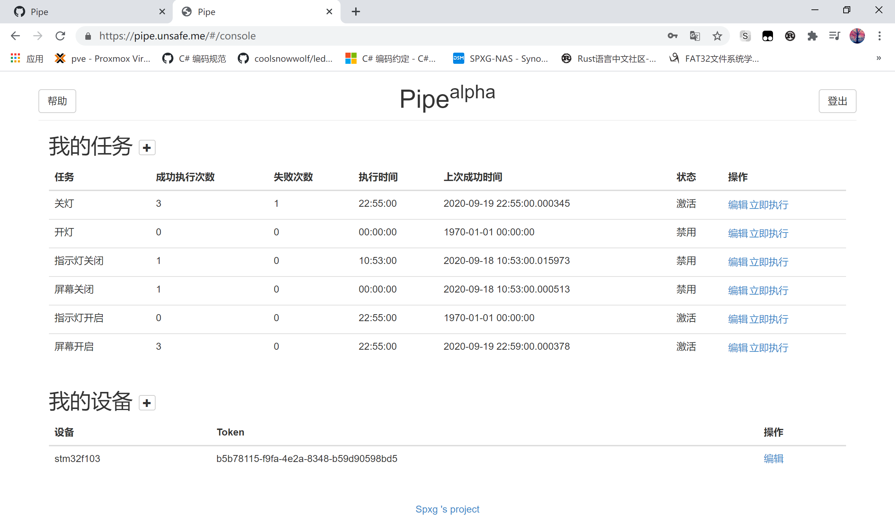

# Pipe

网站：https://pipe.unsafe.me

这是个任务控制中心，在这你可以控制已连接到[核心](https://github.com/pipe-fun/core.git)的设备，可以进行创建任务，修改任务，添加设备，立即执行等操作。当然，控制中心只发送数据，具体实现还得在客户端进行。

[源码全套](https://github.com/pipe-fun)开源，你完全可以选择自行搭建，也可以使用现成服务。

作为Rust初学者，我想多了解Rust的生态，故在[play-stm32](https://github.com/play-stm32)项目之后，有了网络控制单机的想法，这个想法最初在[旧的控制中心](https://github.com/play-stm32/pipe)实现，无奈其水平太低没有更好的解决方案，遂搁置了。到了长假期间，我又重新规划了这个项目，并把它当作单独的一个任务去实现，并在解决问题的过程中不断学习，进步。

从单片机玩到现在Yew前端，我更加了解了Rust的生态

## 实现方案

* [DB-API](https://github.com/pipe-fun/db-api) 使用Actix-Web + Sqlx + PostgreSql实现（还有个分支使用了Rocket + Diesel + MySql）
* [WEB-API](https://github.com/pipe-fun/web-api) 使用Rocket实现
* [Core](https://github.com/pipe-fun/core) 使用async-std实现 

## 网站截图

|              Login              |              Forget               |
| :-----------------------------: | :-------------------------------: |
|  |  |

|              Active               |           Sign Up(Desktop)            |
| :-------------------------------: | :-----------------------------------: |
|  |  |

|               Console               |             Task              |
| :---------------------------------: | :---------------------------: |
|  |  |

|              Device               |               Execute               |
| :-------------------------------: | :---------------------------------: |
|  |  |

## 特别感谢

* 有些同学可能看到了这界面很眼熟，的确，我在写这个项目时，大量使用了binux的[qiandao.today](https://github.com/binux/qiandao)项目的布局， 感谢binux的付出
* 凭我的能力，是不大可能在没有example的情况下写完这个项目的，特别感谢jetli的[rust-yew-realworld-example-app](https://github.com/jetli/rust-yew-realworld-example-app)项目给我的重大指导

## 示例

